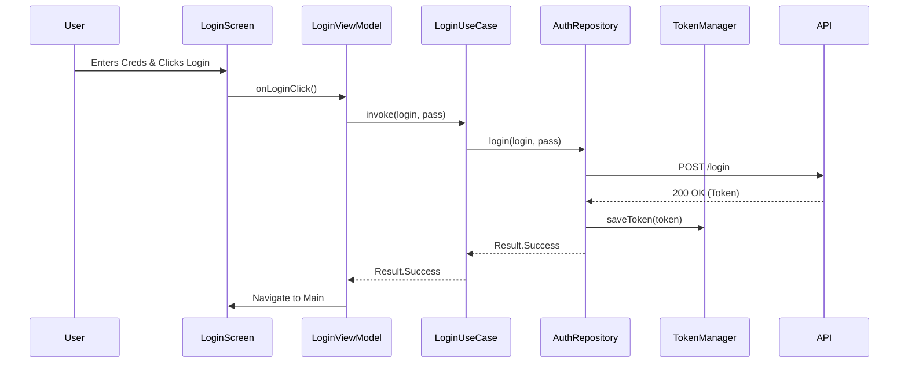
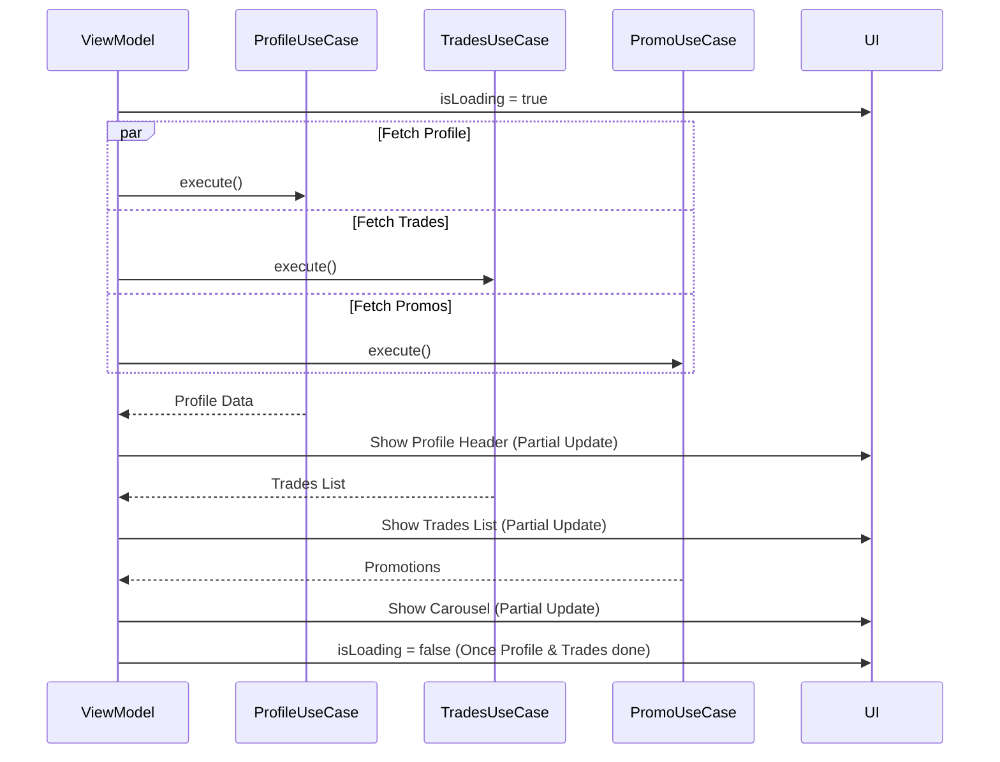

# Peanut Trading App

A production-ready Android application for trading management, built with modern Android development practices (Clean Architecture, Jetpack Compose, Hilt).

## 📱 Project Overview
This application provides a secure interface for users to:
- **Login** securely with credentials.
- **View Dashboard**: Real-time access to User Profile (Balance, ID) and Open Trades.
- **Promotions**: View active marketing campaigns (fetched via SOAP).
- **Manage**: Pull-to-refresh data, persistent login state, and robust error handling.

## 🛠 Tech Stack
*   **Language**: Kotlin
*   **UI Framework**: Jetpack Compose (Material 3)
*   **Architecture**: MVVM + Clean Architecture (Presentation, Domain, Data layers)
*   **Dependency Injection**: Dagger Hilt
*   **Network**: 
    *   **Retrofit + OkHttp**: REST API calls (Login, Trades).
    *   **Manual SOAP Implementation**: Promotions API (XML Parsing).
*   **Concurrency**: Kotlin Coroutines & Flow.
*   **Image Loading**: Coil.
*   **Local Storage**: SharedPreferences (Encapsulated in `TokenManager`).

## 🏗 Architecture & Logic

The project follows a strict **Clean Architecture** pattern to ensure separation of concerns and testability.

### 1. Layer Structure
*   **Presentation Layer** (`com.example.assiggment.presentation`)
    *   **ViewModels**: Hold state (`MainState`), manage UI logic, and map Domain models.
    *   **Screens**: Composable functions (`MainScreen`, `LoginScreen`) that observe State.
    *   **Unidirectional Data Flow**: Events -> ViewModel -> UseCase -> State -> UI.
*   **Domain Layer** (`com.example.assiggment.domain`)
    *   **Models**: Pure Kotlin data classes (`Profile`, `Trade`, `Promotion`).
    *   **UseCases**: Encapsulate single business actions (`GetTradesUseCase`, `LoginUseCase`).
    *   **Interfaces**: Repository definitions (e.g., `MainRepository`).
*   **Data Layer** (`com.example.assiggment.data`)
    *   **Repositories**: Implementations (`MainRepositoryImpl`) that coordinate data sources.
    *   **Remote**: API definitions (`PeanutApi`, `SoapManager`), DTOs.
    *   **Local**: Persistence (`TokenManager`).

### 2. Dependency Injection (Hilt)
All dependencies are provided via `NetworkModule` and `AppModule`.
- `Socket/Retrofit` -> `PeanutApi` -> `Repository` -> `UseCase` -> `ViewModel`.

## 🔄 Flows & Diagrams

### User Login Flow

### Data Loading (Parallel Execution)
The Dashboard loads data in parallel to minimize wait time, with decoupled UI updates.

## 🎨 UI/UX Design Decisions
*   **Adaptive Loading**: The concept of "Partial Rendering" is used. Instead of blocking the entire screen until everything loads, the app shows the Profile as soon as it's ready, then the Trades list. 
*   **Visual Hierarchy**:
    *   **Profile**: High contrast, darker background to anchor the top.
    *   **Promotions**: Colorful carousel to draw attention.
    *   **Trades**: Clean list with Color-coded "Buy/Sell" badges and Green/Red profit indicators for quick scanning.
*   **Robustness**: 
    *   **Pull-to-Refresh**: Integrated swipe gesture to reload current data.
    *   **Error Handling**: Retry buttons and overlay messages when network fails.
    *   **Saved State**: Login ID is preserved across sessions for convenience.

## 🚀 How to Build & Run
1.  **Prerequisites**: Android Studio Hedgehog+ (or newer), JDK 17.
2.  **Open Project**: Select the root directory.
3.  **Sync Gradle**: Allow dependencies to download.
4.  **Run**: Press "Play" to launch on Emulator or Device.
    *   **Credentials**: `2088888` / `ral11lod`
